<h1 align="center">🚀 Docker Weekend Task - 1 🐳</h1>

## 1. What is the Need of DevOps?

DevOps is needed to:

- 🤝 **Bridge the gap** between development and operations teams  
- ⚡ **Improve deployment speed** through automation and CI/CD  
- ✅ **Increase software quality** via continuous testing and monitoring  
- 🗣️ **Enhance collaboration** and communication across the lifecycle  
- 🔁 **Enable faster feedback**, bug fixes, and customer satisfaction  
- 📉 **Reduce failures** and mean time to recovery (MTTR)  
- 🧪 **Support Agile and Lean practices** for faster innovation

---

## 🔍 2. Difference: Virtualization vs Containerization vs Bare Metal

| 🧩 **Feature**      | 🖥️ **Bare Metal**                          | 🧱 **Virtualization**                                  | 📦 **Containerization**                               |
|---------------------|---------------------------------------------|--------------------------------------------------------|--------------------------------------------------------|
| 📖 **Definition**   | Physical machine without any layer          | Running multiple OS via hypervisor                    | Running apps in isolated user-space environments       |
| 🧮 **Resource Usage** | Full resources by one OS                    | More overhead due to multiple OS                      | Lightweight – shares OS kernel                         |
| ⚡ **Speed**        | Fastest (no abstraction layer)               | Slower than bare metal                                | Faster than VMs                                        |
| 🔐 **Isolation**    | N/A (only one environment)                   | Each VM has its own OS                                | Process-level isolation, uses host OS                  |
| 📈 **Scalability**  | Limited                                      | Scalable, with resource overhead                      | Highly scalable, low resource footprint                |
| ⏱️ **Startup Time** | Slow (booting physical machine)              | Minutes (boot guest OS)                               | Seconds (start container)                              |
| 💼 **Use Case**     | High-performance apps, databases             | Multi-OS needs, legacy apps                           | Microservices, CI/CD pipelines, cloud-native apps      |

---

## 3. Create an Apache (httpd) Container

### 🎯 Goal:
- Run an httpd (Apache) container on EC2 Linux.
- Serve `home.html` and `about.html`.
- Use port `80`.
- Accessible at:  
  `http://<EC2_PUBLIC_IP>/home.html`  
  `http://<EC2_PUBLIC_IP>/about.html`

### **Step 1: Launch EC2 and Allow Port 80**
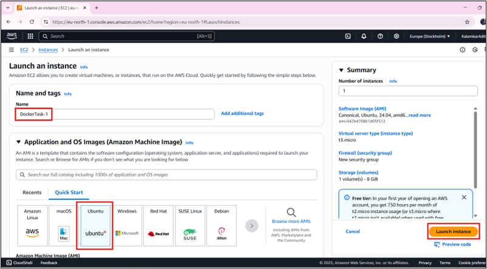


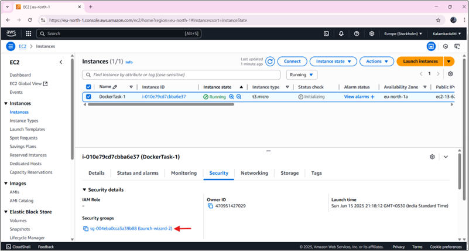

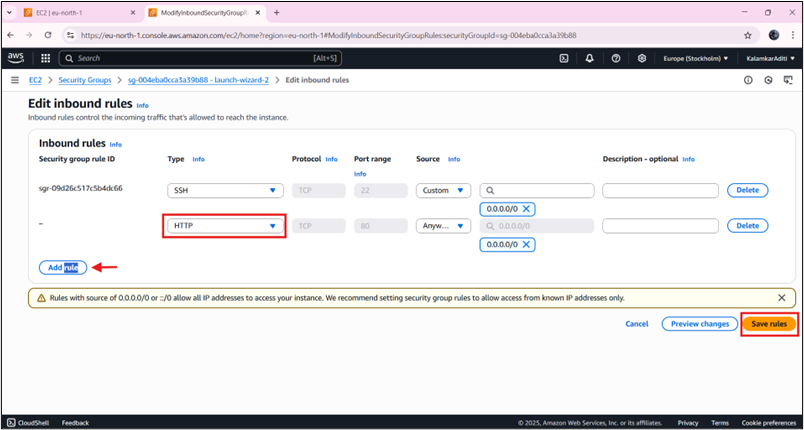

Connect via SSH:

```bash
ssh -i <path-to-pem-file> <user>@<ec2-public-ip>
```

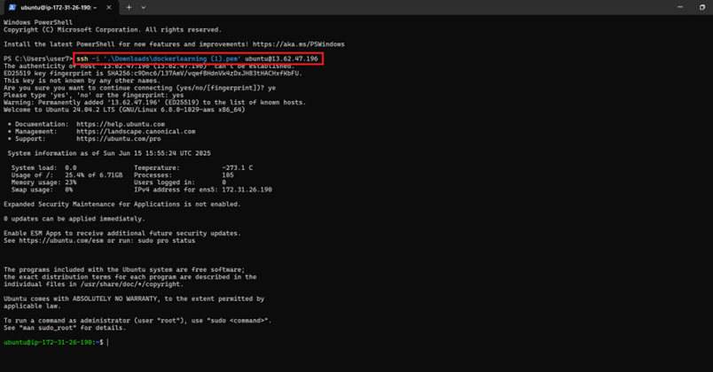

### **Step 2: Install Docker**

```bash
sudo apt-get update
sudo apt-get install docker.io -y
sudo systemctl start docker
sudo systemctl enable docker
sudo systemctl status docker
```

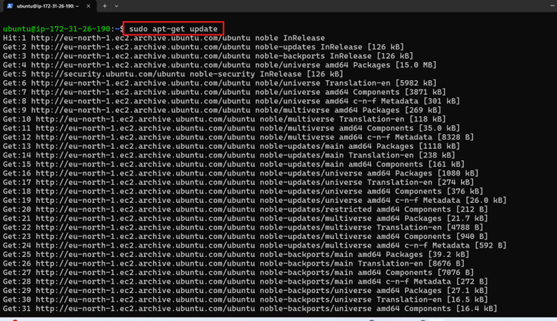

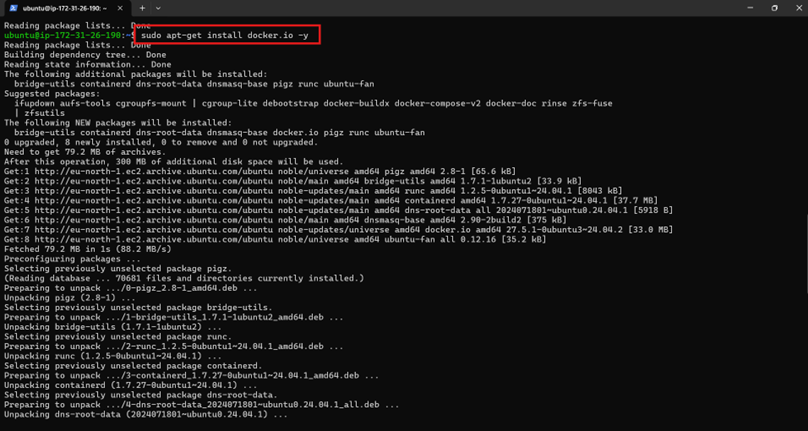

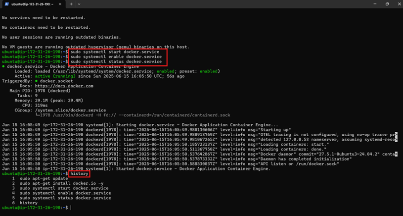

### **Step 3: Run Apache and Add HTML Files**

```bash
sudo docker pull httpd
sudo docker run -d --name apache -p 80:80 httpd
sudo docker exec -it apache bash
apt update && apt install nano -y
cd /usr/local/apache2/htdocs/
nano home.html
nano about.html
```
Use `Ctrl+X`, then `Y` to save and exit nano.

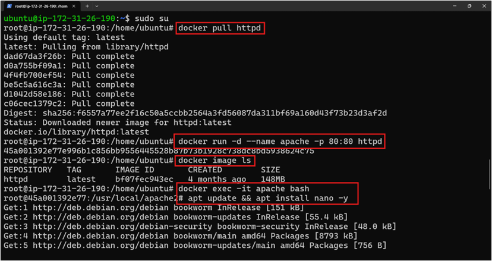


### **Step 4: Access in Browser**

- `http://<EC2-public-IP>/home.html`
- `http://<EC2-public-IP>/about.html`

---
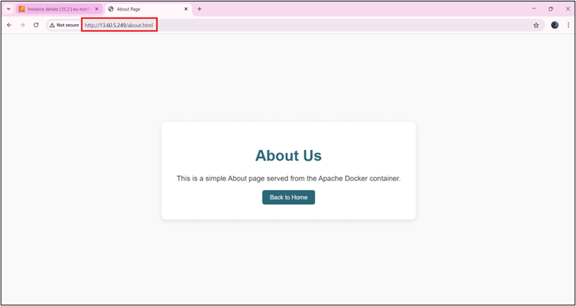
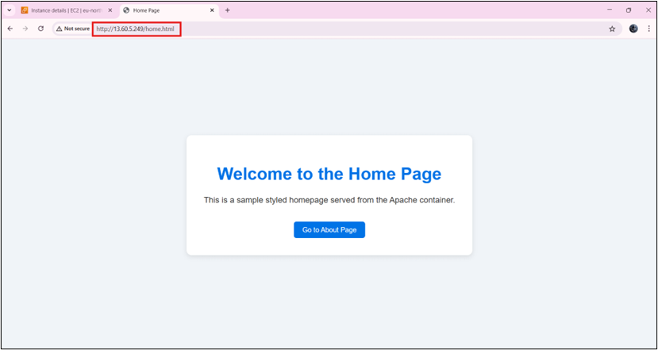

---


## 4. Push Image to Docker Hub & ECR

### a. Docker Hub

#### Step 1: Create Docker Hub Account & Repo

- Sign up at: [https://hub.docker.com](https://hub.docker.com)
- Create repository (e.g., `myhttpd`)

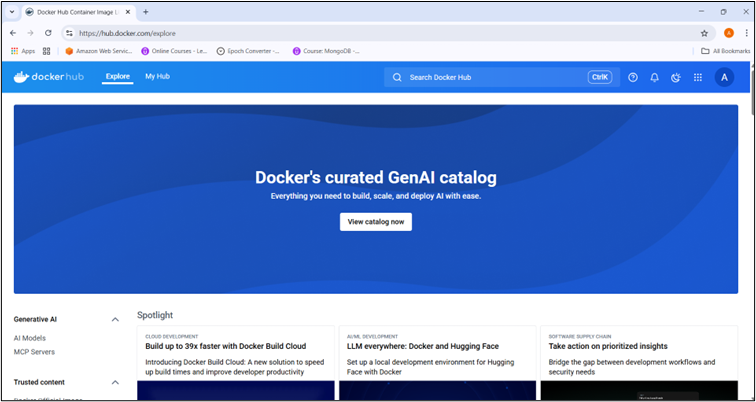

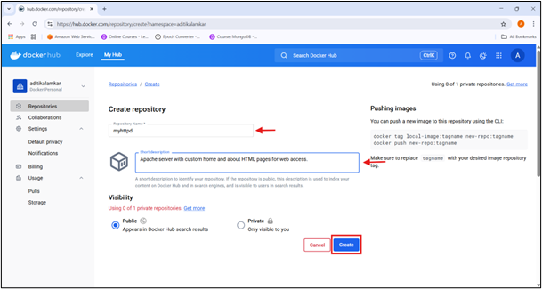

#### Step 2: Commit, Tag, and Push

```bash
sudo su
docker container ls
docker commit apache myhttpd:v1
docker tag myhttpd:v1 <dockerhub-username>/<repo-name>:tag
docker login -u <dockerhub-username>
docker push <dockerhub-username>/<repo-name>:tag
```
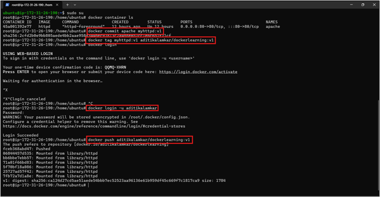

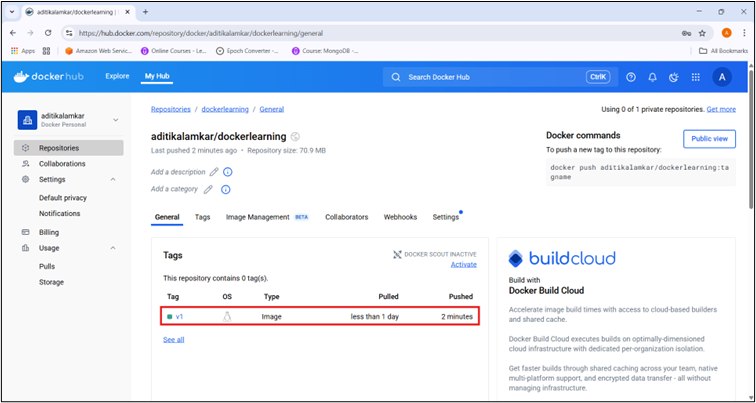
---

### b. AWS ECR

#### Step 1: Create ECR Repository

- Go to AWS Console → ECR → Create repository (e.g., `dockerlearning`)

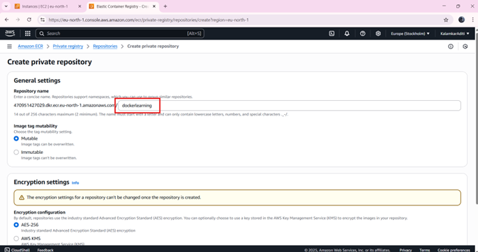

#### Step 2: Install AWS CLI on Ubuntu

```bash
sudo su
apt update
curl "https://awscli.amazonaws.com/awscli-exe-linux-x86_64.zip" -o "awscliv2.zip"
apt install unzip -y
unzip awscliv2.zip
./aws/install
aws --version
```
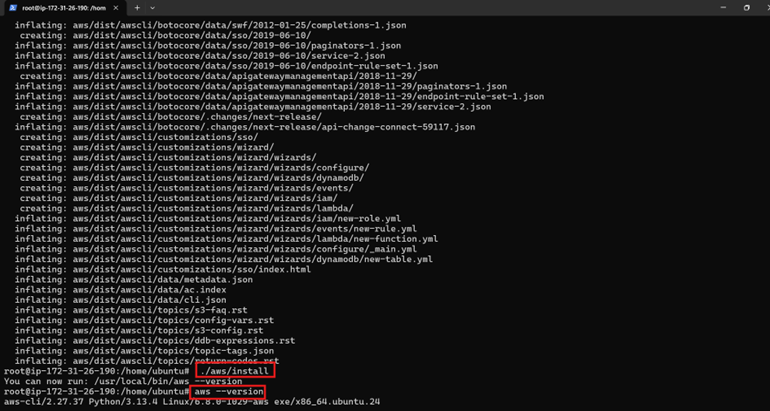


#### Step 3: Push Image to ECR

```bash
aws configure
aws ecr get-login-password --region eu-north-1 | docker login --username AWS --password-stdin <account>.dkr.ecr.eu-north-1.amazonaws.com

docker tag <image-name>:latest <account>.dkr.ecr.eu-north-1.amazonaws.com/dockerlearning:latest

docker push <account>.dkr.ecr.eu-north-1.amazonaws.com/dockerlearning:latest
```

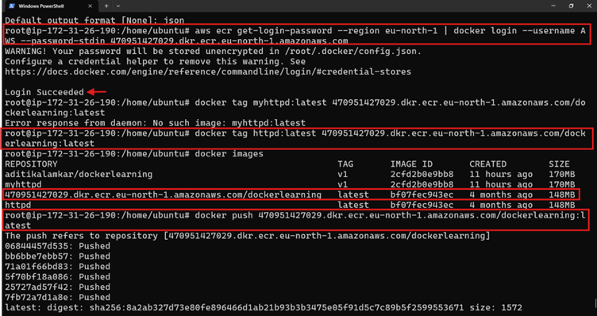

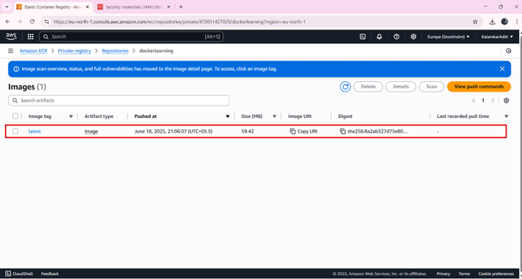
---

## 🛠️ 5. Docker Commands with Usage & Examples

---

### 🐧 Docker Installation & Service Commands

| 🔧 **Command** | 💡 **Description** |
|----------------|--------------------|
| `sudo apt update` | 🔄 Update Ubuntu OS package list |
| `sudo apt install docker.io -y` | 📦 Installs Docker Engine on Ubuntu |
| `sudo systemctl start docker` | ▶️ Starts the Docker service |
| `sudo systemctl enable docker` | 🔁 Enables Docker to start on boot |
| `sudo systemctl status docker` | 📊 Check status of the Docker service |

---

### 🖼️ Docker Image Commands

| 🔧 **Command** | 💡 **Description** |
|----------------|--------------------|
| `sudo su` | 👑 Switch to root user (superuser) to run Docker without `sudo` |
| `docker pull <image-name>` | 📥 Pulls an image from Docker Hub <br>Example: `docker pull httpd` (Apache HTTP server) |
| `docker images` | 🗂️ Lists all locally available Docker images |
| `docker rmi <image_id>` or `docker rmi <image_name>` | ❌ Removes a Docker image |

---

### 📦 Docker Container Commands

| 🔧 **Command** | 💡 **Description** |
|----------------|--------------------|
| `docker run -d --name <container-name> -p <host-port>:<container-port> <image-name>` | 🚀 Runs a container in detached mode with port mapping <br>Example: `docker run -d --name apache -p 80:80 httpd` |
| `docker container ls` | 📋 Lists all **running** containers |
| `docker container ls -a` | 📋 Lists **all** containers (running + stopped) |
| `docker stop <container-name>` | ⛔ Stops the specified container |
| `docker rm <container-name>` | 🗑️ Removes the specified container |

---

✅ These commands are essential for starting with Docker on Ubuntu. 

---

## ✅ Conclusion - Docker Weekend Task 01

This Docker Weekend Task provided a practical understanding of containerization using Docker and demonstrated how to host simple web content using Apache inside a Docker container.

### 🚀 Key Learnings:

- **DevOps Importance:** Understood the significance of DevOps practices in bridging development and operations, improving deployment speed, and enhancing software quality.
- **Technology Comparison:** Differentiated between bare metal, virtualization, and containerization, gaining clarity on their use cases and performance trade-offs.
- **Apache Container Deployment:** Successfully deployed an `httpd` (Apache) web server using Docker on an EC2 instance, and hosted `home.html` and `about.html` pages.
- **Docker Image Management:** Learned to commit, tag, and push Docker images to:
  - **Docker Hub:** For public access and distribution.
  - **AWS ECR:** For private, secure container storage in AWS environments.
- **Command Familiarity:** Acquired hands-on experience with essential Docker commands including `docker pull`, `run`, `exec`, `commit`, `push`, and image/container management.

### 📦 Real-World Application:

These skills are directly applicable to modern CI/CD pipelines, microservices architecture, and cloud-native deployments. Mastery of container-based deployment enhances efficiency and scalability in real-world DevOps practices.

---

> This task forms a strong foundation for future projects involving advanced orchestration (like Kubernetes), monitoring, and automation in production environments.

