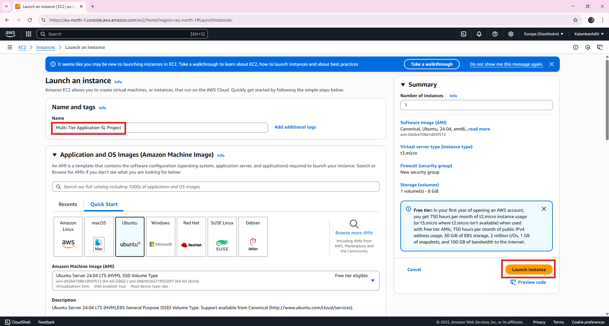
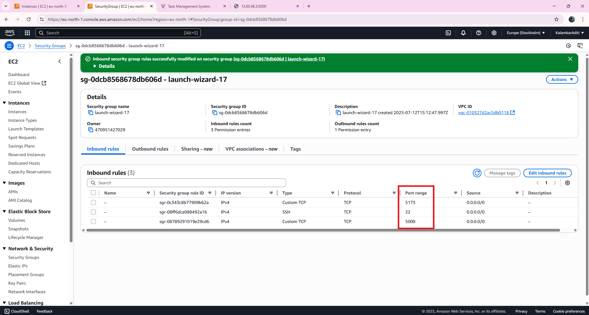
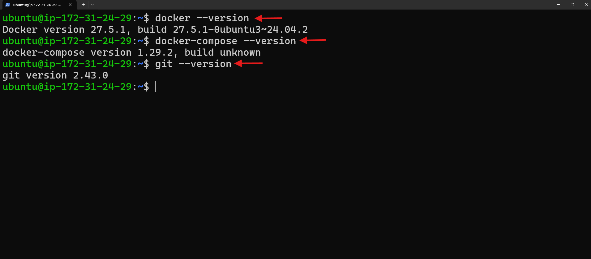
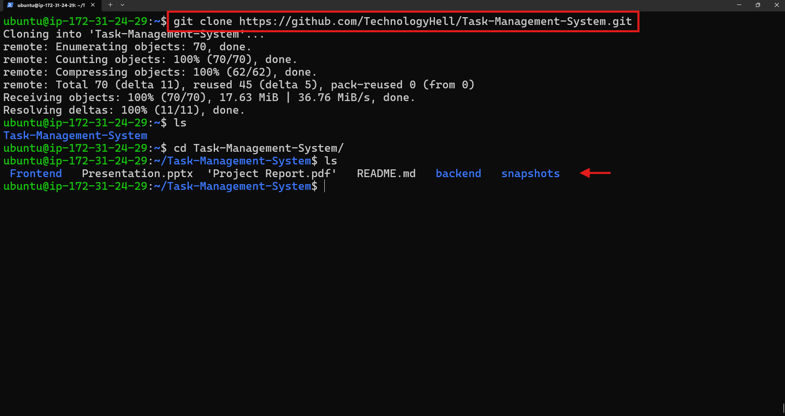
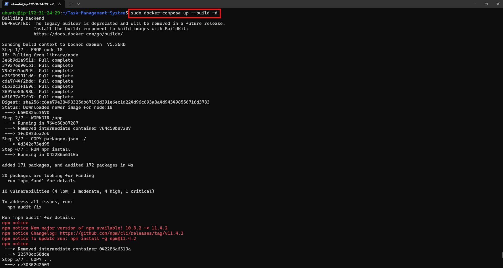
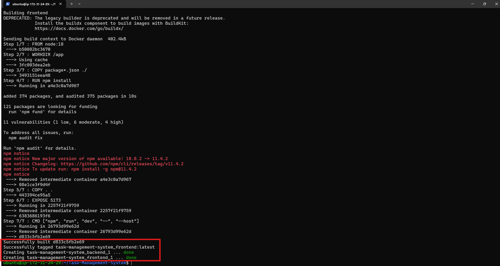
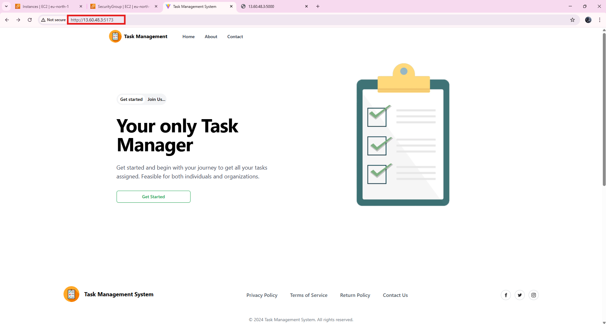
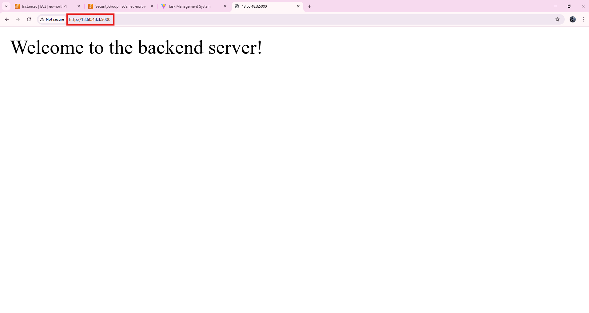

# 🚀 Deploying Multi-Tier Application with Docker Compose

## 🎯 Objective

To demonstrate the deployment of a multi-tier application using Docker Compose, including configuring public IP addresses and setting up necessary security group rules for accessing the frontend, API, and database services.

---

## 🌐 Real-time Scenario

A user is tasked to deploy a multi-tier application on a cloud-based virtual machine using Docker Compose. After installing Docker, Docker Compose, and Git, they clone the application repository and update configuration files with the machine's public IP to ensure proper communication between the frontend, API, and backend components.

After these updates, the user:
- Runs `docker-compose` to bring up the application.
- Adjusts the security group settings to allow traffic on specific ports (`8080`, `5000`, `5173`).
- Verifies the deployment by accessing the app via the public IP.

✅ This confirms that all components are accessible and functional.

---

## 🔢 Step 1: Launch an EC2 Instance

1. Go to **AWS EC2 Dashboard**
2. Click **Launch Instance**
3. Choose:
   - **AMI**: Ubuntu 22.04 LTS
   - **Instance type**: `t2.micro`
   - **Key pair**: Select or create one
   - **Security Group Rules**:

| Type        | Protocol | Port Range | Source        |
|-------------|----------|------------|----------------|
| SSH         | TCP      | 22         | My IP          |
| Custom TCP  | TCP      | 5000       | 0.0.0.0/0      |
| Custom TCP  | TCP      | 5173       | 0.0.0.0/0      |

4. Launch the instance
5. Connect via terminal:

```bash
ssh -i your-key.pem ubuntu@your-ec2-public-ip
```





---

## 🔢 Step 2: Install Docker, Docker Compose, and Git

### ✅ 1. Update Package Index
```bash
sudo apt update
```

### ✅ 2. Install Docker Engine, Start & Enable Docker
```bash
sudo apt install -y docker.io
sudo systemctl start docker
sudo systemctl enable docker
```

### ✅ 3. Install Docker Compose
```bash
sudo apt install -y docker-compose
```

### ✅ 4. Install Git
```bash
sudo apt install -y git
```

### ✅ 5. Verify Installations
```bash
docker --version
docker-compose --version
git –version
```
### 📌 Or run all at once:

```bash
docker --version && docker-compose --version && git --version
```

---



## 🔢 Step 3: Clone the GitHub Repository

```bash
git clone https://github.com/TechnologyHell/Task-Management-System.git
cd Task-Management-System
ls
```

---



## 🔢 Step 4: Create Dockerfiles

### 📁 `backend/Dockerfile`
```Dockerfile
FROM node:18
WORKDIR /app
COPY package*.json ./
RUN npm install
COPY . .
EXPOSE 5000
CMD ["node", "index.js"]
```

### 📁 `Frontend/Dockerfile`
```Dockerfile
FROM node:18
WORKDIR /app
COPY package*.json ./
RUN npm install
COPY . .
EXPOSE 5173
CMD ["npm", "run", "dev"]
```

---

## 🔢 Step 5: Create `docker-compose.yml`

📄 In the **root directory**:
```yaml
version: '3'
services:
  backend:
    build: ./backend
    ports:
      - "5000:5000"

  frontend:
    build: ./Frontend
    ports:
      - "5173:5173"
```


---

## 🔢 Step 6: Build and Run the Containers

```bash
sudo docker-compose up --build -d
```




---

## 🔢 Step 7: Access the Application

✅ **Frontend**:  
[http://EC2-PUBLIC-IP:5173](http://<EC2-PUBLIC-IP>:5173)  

✅ **Backend API**:  
[http://EC2-PUBLIC-IP:5000](http://<EC2-PUBLIC-IP>:5000)






---

## ✅ Conclusion

In this project, we successfully deployed a multi-tier Task Management System on an Ubuntu EC2 instance using Docker and Docker Compose.

Steps Completed:
- ✅ Cloned the GitHub repository  
- ✅ Created Dockerfiles for frontend and backend  
- ✅ Configured `docker-compose.yml`  
- ✅ Opened necessary ports in the security group  
- ✅ Built and deployed the application  
- ✅ Accessed both services via public IP

This setup ensures isolated, portable, and reproducible deployment of applications in the cloud.

---
