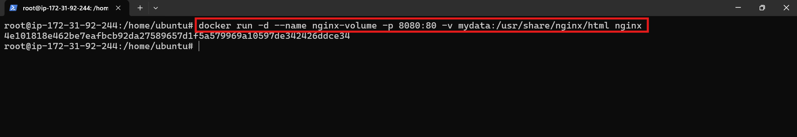

<h1 align="center">🚀 Docker Weekend Task - 2 🐳</h1>


### 1.  Write a brief explanation of what Docker volumes are and why they are used in containerized environments. State different types of volumes in Docker and also make a note on difference between them. 

Docker **volumes** are storage mechanisms used for **long-term data** created and consumed by containers. Unlike data stored inside the container filesystem (which is lost when the container is removed), **volumes persist** beyond container lifecycles.

They are managed by Docker and are typically used to:
- Share data between containers
- Store database files, logs, uploads, etc.
- Improve performance, portability, and flexibility

> Volumes are stored in a Docker-specific path (`/var/lib/docker/volumes/`) and are more stable than bind mounts, especially across platforms.

---

## 🔍 Why Use Docker Volumes

### 1. ✅ Data Persistence
Volumes ensure data is **retained** even if a container is stopped, deleted, or recreated.

> 📌 Example: A MySQL container using a volume won’t lose database data on restart.

---

### 2. 🔄 Data Sharing Between Containers
Multiple containers can access the **same volume** simultaneously. Useful in:
- Microservices architectures
- Shared file processing (e.g., one container uploads, another processes)

---

### 3. 🧱 Clean Separation of Concerns
Volumes keep **code and data separate**, allowing:
- Stateless containers
- More modular and maintainable application structure

---

### 4. 💾 Backup & Restore
Because volumes are Docker-managed:
- They’re easy to back up or migrate
- Data can be archived and moved between environments (e.g., dev → prod)

---

### 5. ⚡ Performance
- Optimized for fast disk I/O
- Avoid common syncing issues found in bind mounts on Windows/macOS

---

## 📂 Types of Docker Volumes

| Type              | Description                                                                 |
|-------------------|-----------------------------------------------------------------------------|
| **Named Volumes** | Created and managed by Docker. Stored in `/var/lib/docker/volumes/`. Ideal for long-term storage and sharing. |
| **Anonymous Volumes** | Like named volumes, but without a specific name. Deleted with the container unless retained. |
| **Bind Mounts**   | Mounts a specific path from the host into the container. More control, less portability. |
| **tmpfs Mounts**  | Stores data in **RAM only** (non-persistent). Best for sensitive or temporary data. |

---

## 🔁 Key Differences Between Volume Types

| Feature         | Named Volume | Anonymous Volume | Bind Mount | tmpfs Mount |
|----------------|--------------|------------------|------------|-------------|
| **Persistence** | ✅ Yes       | ⚠️ Short-term     | ✅ Yes     | ❌ No       |
| **Location**    | Docker-managed | Docker-managed | Host-defined | In-memory  |
| **Sharing**     | ✅ Yes       | ⚠️ Limited        | ✅ Yes     | ❌ No       |
| **Ease of Use** | ✅ High      | ⚠️ Medium         | ❌ Low     | ⚠️ Medium   |
| **Security**    | ✅ High      | ⚠️ Medium         | ❌ Low     | ✅ High     |
| **Use Case**    | Databases, persistent logs | Temporary scratch space | Config file mounting | Sensitive, in-memory secrets |

---

## 📝 Summary

- **Named Volume**: Best for persistent, shareable data (e.g., databases).

- **Anonymous Volume**: Temporary storage without explicit naming.
- **Bind Mount**: Best for development and configuration, but less secure.
- **tmpfs Mount**: Best for sensitive or temporary data that should never persist.

---


### 2. Demonstrate the Use of Named Volume

    • Create a Docker Named volume named mydata.  
    • Attach volume to a Nginx Container  
    • Create an HTML file named index.html with some content (e.g., "Hello, Docker Volumes!") on your host machine. Copy this file into the mydata.  
    • Verify that the index.html file is accessible from within the container by starting a simple HTTP request.  

---


## 🧱 Step 1: Create a Named Volume


```bash
docker volume create mydata
```


---

## 📝 Step 2: Create `index.html` File on Host


```bash
echo "Hello, Docker Volumes!" > index.html
```


---

## 📂 Step 3: Copy `index.html` into the Volume

Docker named volumes are stored under:

```
/var/lib/docker/volumes/mydata/_data
```

Use this to move the file:

```bash
sudo cp index.html /var/lib/docker/volumes/mydata/_data/
```


---
## 🚀 Step 4: Run NGINX Container with the Volume

Mount the volume to the default web root:

```bash
docker run -d --name nginx-vol -p 8080:80 -v mydata:/usr/share/nginx/html nginx
```



---

## ✅ Step 5: Verify the Setup

### Option 1: Using curl

```bash
curl http://localhost:8080
```


### Option 2: Open in Web Browser

Go to: `http://<EC2-public-IP>:8080`  
🛑 Ensure port `8080` is open in EC2 Security Group Inbound Rules.


---

## 🧹 Step 6: Clean Up

Stop and remove container and volume:

```bash
docker rm -f nginx-vol
docker volume rm mydata
```


---

### 3. Write a brief explanation of what Docker networks. Write the difference between host network and bridge network. 


Docker networks enable **communication between containers**, and between **containers and the host machine or external systems**. They provide **isolated, secure communication channels** so containers can interact with each other or with services outside the container environment.

When Docker runs a container, it connects it to a **network** — which can be default or custom.

---
## 🌐 Types of Docker Networks

- 🔗 **Bridge (default)** – Used by default for standalone containers.

- 🖥️ **Host** – Container shares the host’s networking stack.
- 🚫 **None** – No network access (completely isolated).
- 📡 **Overlay** – Used in Docker Swarm for multi-host communication.
- 🧭 **Macvlan** – Assigns a MAC address to a container, making it appear as a physical device.

---

## 🔍 Difference Between Host and Bridge Network

| 🔧 Feature           | 🌉 Bridge Network                                 | 🖥️ Host Network                                  |
|----------------------|---------------------------------------------------|--------------------------------------------------|
| **Isolation**         | Containers have their own network namespace      | Shares the host's network namespace              |
| **IP Address**        | Private IP (e.g., `172.x.x.x`)                   | Uses host’s IP address                           |
| **Port Mapping**      | Required (e.g., `-p 8080:80`)                    | Not required (uses host ports directly)          |
| **Use Case**          | Default for container-to-container communication| High-performance apps needing low latency        |
| **Security**          | More secure due to namespace isolation           | Less secure; container accesses host network     |
| **Performance**       | Slight overhead due to network translation       | Better performance, no network translation       |
| **Docker Compose**    | ✅ Supported                                      | ⚠️ Limited (must be configured manually)          |

---

### 📌 Examples

- 🌉 **Bridge**: Microservices app where containers need to talk via service names.
- 🖥️ **Host**: High-performance apps (like game servers or monitoring tools) that need direct access to network interfaces.

---

### 4. Demonstrate the Use of Custom Network

    • Create a custom bridge network named my_network. 
    • Start two containers, one using the nginx image and another using the httpd  image. 
    • Attach both containers to the my_network network. 
    • Test Network Connectivity: Ensure that the nginx container can communicate with the httpd container over the custom network. You can dothis by sending an HTTP request from one container to another using tools 
    like curl.

---


## 🔹 Step 1: Create a Custom Bridge Network

Use the following command to create a custom network:

```bash
docker network create --driver bridge my_network
```


---

## 🚀 Step 2: Start the Containers on the Custom Network

Launch two containers using `nginx` and `httpd` images and attach them directly to the `my_network` network:


```bash
docker run -d --name my-nginx nginx
docker run -d --name my-httpd httpd
```


---

## 🔗 Step 3: Connect Containers to the Custom Network 


```bash
docker network connect my_network my-nginx
docker network connect my_network my-httpd
```


---

## 🧪 Step 4: Test Network Connectivity

Enter the `nginx` container, install `curl`, and test connection to the `httpd` container:

```bash
docker exec -it my-nginx sh
curl http://my-httpd
```
 


---

## 🧹 Step 5: Cleanup (Disconnect & Remove Containers and Network)

```bash

docker network disconnect my_network my-nginx
docker network disconnect my_network my-httpd

docker rm -f my-nginx my-httpd

docker network rm my_network
```


---

✅ **Conclusion**

You've successfully:

- Created a custom bridge network  
- Attached containers to it  
- Verified inter-container communication  
- Cleaned up resources

---


### 5. Write a note on Dockerfile with usage of its attributes

A **Dockerfile** is a text file that contains step-by-step instructions on how to build a Docker image.  
It defines the **base image**, sets up the environment, copies application code, installs dependencies, exposes ports, and specifies the command to run the application.

It is the **blueprint** for creating Docker images in a **repeatable, automated** way.

---

## 🔧 Common Dockerfile Instructions

| Instruction  | Description |
|--------------|-------------|
| `FROM`       | Sets the base image. Must be the first instruction (except optional ARGs). <br> _Example_: `FROM ubuntu:20.04` |
| `LABEL`      | Adds metadata. <br> _Example_: `LABEL version="1.0"` |
| `ENV`        | Sets environment variables. <br> _Example_: `ENV PATH="/app/bin:$PATH"` |
| `WORKDIR`    | Sets the working directory. <br> _Example_: `WORKDIR /app` |
| `COPY`       | Copies files from host to container. <br> _Example_: `COPY . /app` |
| `ADD`        | Same as COPY, but also supports remote URLs and auto-extracts archives. |
| `RUN`        | Executes commands at build time. <br> _Example_: `RUN apt-get update && apt-get install -y nginx` |
| `CMD`        | Sets default command to run when container starts. <br> _Example_: `CMD ["nginx", "-g", "daemon off;"]` |
| `ENTRYPOINT` | Sets the main command that is harder to override. |
| `EXPOSE`     | Documents the port used by the container. |
| `ARG`        | Defines build-time variables. <br> _Example_: `ARG version=1.0` |
| `VOLUME`     | Creates a mount point for persistent data. |
| `USER`       | Sets the user for running the container. |
| `HEALTHCHECK`| Defines how Docker should check container health. |
| `MAINTAINER` | Specifies who built or maintains the image. |

---

## ✅ Benefits of Using Dockerfile

- Automation of image creation  
- Consistency across environments  
- Easier version control and debugging  
- Reusability and modular builds

---

### 6. What is difference between CMD and ENTRYPOINT? 

Dockerfile instructions CMD and ENTRYPOINT specify which command should be 
executed when a container starts. But they behave differently and have different functions. 

| Feature         | `CMD`                                 | `ENTRYPOINT`                             |
|-----------------|----------------------------------------|------------------------------------------|
| **Purpose**      | Sets default command or arguments      | Defines a fixed command to run            |
| **Overridable**  | ✅ Yes, fully                          | ❌ No, only args appended                 |
| **Command Type** | Used as default params                 | Treated as the main executable            |
| **Use Case**     | When default behavior can be changed   | When a command should always run          |
| **Format**       | Shell or exec: `["arg1", "arg2"]`      | Exec format: `["executable", "param"]`    |
| **Flexibility**  | ✅ High                                | ⚠️ Low                                    |
| **Ignored if ENTRYPOINT is set** | ✅ Yes                | ❌ No                                     |
| **Example**      | `CMD ["npm", "start"]`                | `ENTRYPOINT ["nginx"]`                   |

---

### 7.  What is difference between ADD and COPY?

To move files or directories from the host computer to the Docker image, use the ADD and 
COPY Dockerfile instructions. Their use cases and functionalities vary. 

| Feature              | `COPY`                              | `ADD`                                               |
|----------------------|--------------------------------------|-----------------------------------------------------|
| **Function**          | Copies files to container           | Copies with extra features                          |
| **Archive Extraction**| ❌ No                               | ✅ Yes (e.g., `.tar.gz`)                            |
| **Remote URL**        | ❌ No                               | ✅ Yes                                              |
| **Clarity**           | ✅ Simple & explicit                | ⚠️ May vary based on source                         |
| **Preferred Use**     | Default file copying                | Special cases only (URLs or archives)               |
| **Best Practice**     | Use for most cases                  | Use when features like archive/URL are needed       |
| **Security**          | ✅ More secure                      | ⚠️ Slightly riskier due to auto-download/extract    |

---

### 8. Dockerfile to Run Node.js App with Volume and Network

## 🧱 Step 1: Create Project Structure


```
my-node-app/
├── Dockerfile
├── docker-compose.yml
├── index.js
└── package.json
```

---


## ✍️ Step 2: Create `index.js` (Node.js App)

```js
const http = require('http');
const PORT = 3000;

const server = http.createServer((req, res) => {
  res.end("Hello from Dockerized Node.js App!");
});

server.listen(PORT, () => {
  console.log(`Server is running on http://localhost:${PORT}`);
});
```


---

## 📦 Step 3: Create `package.json`

```json
{
  "name": "my-node-app",
  "version": "1.0.0",
  "main": "index.js",
  "scripts": {
    "start": "node index.js"
  },
  "dependencies": {}
}
```


---

## 🐳 Step 4: Create `Dockerfile`

```Dockerfile
FROM node:18

WORKDIR /usr/src/app
COPY package*.json ./
RUN npm install

COPY . .

EXPOSE 3000

CMD ["node", "index.js"]

```


---

## ⚙️ Step 5: Create `docker-compose.yml`

```yaml
version: '3.8'

services:
  nodeapp:
    build: .
    container_name: node-container
    ports:
      - "3000:3000"
    volumes:
      - node_data:/usr/src/app/data
    networks:
      - node_network

volumes:
  node_data:

networks:
  node_network:
    driver: bridge
```


---

## 🏗️ Step 6: Build and Run the Application

```bash
docker-compose up --build -d
```

 

---

## 🔍 Step 7: Test the Application

### ✅ Option 1: Using `curl`

```bash
curl http://localhost:3000
```


### 🌐 Option 2: Open in Web Browser

[http://<public_Ip>:3000](http://public_Ip:3000)


---

## 📁 Step 8: Check Persistent Log Volume

```bash
docker exec -it node-container cat /usr/src/app/data/access.log
```

 

---

### 9. Write a Dockerfile to create a python application build image from it and push that image to private repository of Docker hub. 

## 🧱 Step 1: Create Your Python Project

```
my-python-app/
├── app.py
├── requirements.txt
└── Dockerfile
```

 

---

## ✍️ Step 2:  Create Python App  `app.py`

```python
# app.py
from flask import Flask
app = Flask(__name__)

@app.route('/')
def home():
    return "Hello from Python Docker App!"

if __name__ == '__main__':
    app.run(host='0.0.0.0', port=5000)

```

 

---

## 📦 Step 3: Create `requirements.txt`

```txt
flask
```


---

## 🐳 Step 4: Create `Dockerfile`

```Dockerfile
FROM python:3.10-slim
WORKDIR /app
COPY requirements.txt
RUN pip install --no-cache-dir -r requirements.txt
COPY . .
EXPOSE 5000
CMD ["python", "app.py"]
```
 

---

## 🚀 Step 5: Build the Docker Image

```bash
docker build -t my-python-app .
```
 

---
## 🔐 Step 6: Log In to Docker Hub

Use the following command to log in:

```bash
docker login -u <username>
```

Provide your Docker Hub username and password when prompted.


---

## 🚀 Step 7: Push the Image to Docker Hub


```bash
docker push yourdockerid/my-private-python-app:tag
```


---

## ▶️ Step 8: Run the Image

Pull and run the image on any machine (or your EC2 server):

```bash
docker run -d -p 5000:5000 yourdockerid/my-python-app
```


Test in browser :


[http://<public_Ip>:5000](http://public_Ip:5000)


---
# ✅ Conclusion - Docker Weekend Task 2

This task provided hands-on experience with core Docker concepts and commands crucial for containerization in real-world DevOps workflows. By completing this task, I have:

- Understood and demonstrated the use of **Docker volumes** (named, anonymous, bind mount, tmpfs) to manage persistent data across containers.
- Implemented **Docker networking**, including bridge and host networks, and successfully set up **custom bridge networks** for multi-container communication.
- Learned the structure and usage of a **Dockerfile** including essential instructions like `FROM`, `COPY`, `RUN`, `CMD`, `ENTRYPOINT`, and more.
- Gained clarity on the differences between **CMD vs ENTRYPOINT** and **COPY vs ADD**, and when to use each effectively.
- Built and ran a **Node.js application** in a container with persistent storage and custom networking via `docker-compose`.
- Dockerized a **Python application** and pushed it to a **private Docker Hub repository** securely.
- Practiced best practices in containerizing applications and preparing clean documentation with practical screenshots and explanations.

These skills are foundational for DevOps roles and will be directly applicable to building CI/CD pipelines, orchestrating containers in Kubernetes, and automating deployments in cloud environments.
